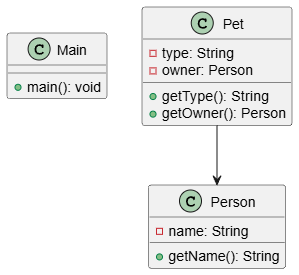

# UML Generator (Java → PlantUML)

A simple tool to generate **UML class diagrams** from Java projects using Python.

## ✨ Features

* Parse `.java` files from a directory
* Extract:

  * Classes
  * Attributes
  * Methods
* Detect basic relationships between classes
* Generate `.puml` files compatible with PlantUML

---

## 📊 Example Diagram

<p align="center">
  
</p>

---

## 📁 Project Structure

```text
uml_generator/
├── assets/
│    └── basic-class-diagram-example.png
├── src/
│   ├── parser.py
│   ├── generator.py
│   └── model.py
├── examples/
│   ├── basic-class-diagram-example/
│   └── basic-class-diagram-example.puml
├── output/
│   └── basic-class-diagram-example.puml
└── main.py
```

---

## 🚀 Getting Started

### 1. Clone the repository

```bash
git clone https://github.com/Mannyyo/uml-generator.git
cd uml_generator
```

---

### 2. Install dependencies

```bash
pip install javalang
```

---

### 3. Run the generator

```bash
python main.py <path-to-java-src>
```

Example:

```bash
python main.py examples/basic-class-diagram-example/src
```

---

## 📄 Output

The generated `.puml` file will be saved in:

```text
output/<project-name>.puml
```

---

## 👀 Viewing the Diagram

You can visualize the result using:

* PlantUML online server
* VS Code with PlantUML extension
* PlantUML CLI

---

## 🧪 Example

Input:

```java
class Pet {
    private Person owner;
}
```

Output:

```plantuml
Pet --> Person
```

---

## ⚠️ Limitations

This is a **basic static analyzer**, so it currently does NOT support:

* Inheritance (`extends`)
* Interfaces (`implements`)
* Generics (e.g. collections of objects)
* Complex relationships
* Detailed method parameters

---

## 🔮 Future Improvements

* Support for inheritance and interfaces
* Multiplicity detection for collections
* Sequence diagram generation
* CLI improvements (`--output`, `--format`)
* Automatic image generation (`.png`, `.svg`)

---

## 🛠️ Technologies

* Python
* javalang
* PlantUML

---

## 📌 Notes

This project was built as a learning tool to explore:

* Static code analysis
* UML generation
* Tooling and automation
